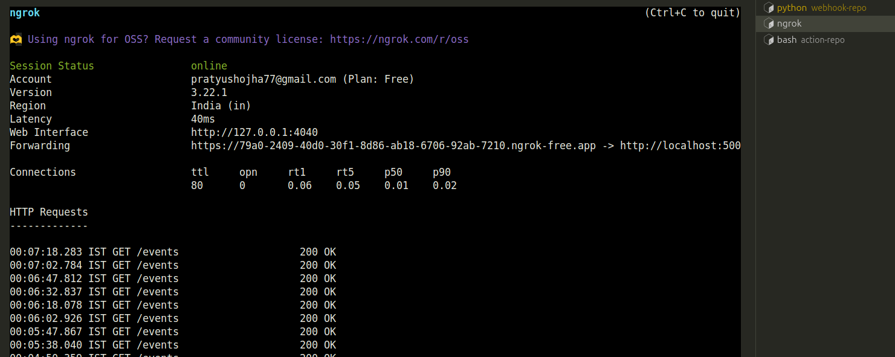

# GitHub Webhook Events Project Documentation

## Introduction

Welcome to the **GitHub Webhook Events Project**, a dynamic web application that tracks and displays real-time events from a GitHub repository, including Push, Pull Request, and Merge activities. Powered by a Flask backend, this project captures event notifications via a GitHub webhook, stores them in a MongoDB database, and showcases them in an intuitive browser-based interface. Running locally and exposed to the internet via `ngrok`, it’s perfect for developers and teams monitoring repository activity, with potential for expansion into notifications, analytics, or automation.

This documentation provides a comprehensive guide to understanding, setting up, using, and maintaining the project, ensuring a seamless experience for all users.

---
## Some glimps of the project

## Project Overview

### Purpose
The GitHub Webhook Events Project enables real-time monitoring of repository events, offering visibility into commits, pull requests, and merges. It serves as a foundation for webhook-based integrations, making it valuable for development teams or individual developers tracking project progress or building custom workflows.

### Key Features
- **Event Capture**: Tracks Push, Pull Request, and Merge events from a specified GitHub repository.
- **Data Storage**: Stores event details (request ID, author, action type, branches, timestamp) in MongoDB.
- **Dynamic Interface**: Displays events in a web UI that refreshes every five seconds.
- **Public Access**: Uses `ngrok` to expose the local Flask server to GitHub’s webhook.
- **Robust Logging**: Provides detailed logs for debugging webhook processing and errors.

### Use Case
Ideal for monitoring repository activity, this application supports real-time tracking of development workflows. It can be extended to integrate notifications (e.g., Slack alerts), generate event analytics, or trigger automated processes based on repository events.

---

## Project Architecture

### Components

#### GitHub Repository (`action-repo`)
- A public or private repository hosted at `https://github.com/pratyushojha04/action-repo`.
- Configured with a webhook to send event notifications to the Flask application via a public `ngrok` URL.

#### ngrok
- A tunneling tool exposing the local Flask server (`http://localhost:5000`) to a public URL, such as `https://12b1-2409-40d0-30f1-8d86-ab18-6706-92ab-7210.ngrok-free.app`.
- Runs version 3.22.1, installed via `snap`, with a free plan generating new URLs on restart.

#### Flask Application
- A Python-based web server using Flask, managing webhook requests and serving the web interface.
- Features three endpoints:
  - **Root (`/`)**: Displays the main web page.
  - **Events (`/events`)**: Provides stored events as JSON for the frontend.
  - **Webhook (`/webhook`)**: Processes incoming GitHub webhook payloads.
- Located at `~/Documents/jobs_assesments/teckstax/webhook-repo`.

#### MongoDB
- A NoSQL database storing event data in the `github_events` database, `events` collection.
- Uses version 8.0.4, running locally on `mongodb://localhost:27017`.

#### Frontend
- Comprises an HTML page, CSS for styling, and JavaScript for dynamic updates.
- Renders a list of events with details like author and action, refreshing every five seconds.

### Data Flow
1. A Push, Pull Request, or Merge event occurs in `action-repo`.
2. GitHub sends a notification to the `ngrok` public URL’s webhook endpoint.
3. The Flask application validates the event, extracts data, and stores it in MongoDB.
4. The frontend fetches events from the Flask server and updates the web interface.
5. Logs and the `ngrok` dashboard offer insights into requests and errors.

**Image Placeholder 1**: *Insert `image.png` here, showing the project architecture diagram or data flow overview. Caption: "Overview of the GitHub Webhook Events Project data flow, illustrating interactions between GitHub, ngrok, Flask, MongoDB, and the frontend."*

---

## Project Setup

### Prerequisites
- **Operating System**: Ubuntu 24.04 or compatible Linux distribution.
- **Python**: Version 3.8+, with virtual environment support, installed in a `base` conda environment.
- **MongoDB**: Version 8.0.4, installed and running locally.
- **ngrok**: Version 3.22.1, installed via `snap`.
- **GitHub Account**: Required for repository creation and webhook configuration.
- **Git**: Installed for repository operations.
- **curl**: Optional, for manual webhook testing.

### Directory Structure
- **webhook-repo**: Houses the Flask application, including server logic, web templates, and static files (styling and client-side scripts), at `~/Documents/jobs_assesments/teckstax/webhook-repo`.
- **action-repo**: A clone of the GitHub repository, containing sample files like `README.md` and `test.txt`, at `~/Documents/jobs_assesments/teckstax/action-repo`.

### Installation Steps

#### 1. Prepare Repositories
- **webhook-repo**:
  - Create a directory at `~/Documents/jobs_assesments/teckstax/webhook-repo` for the Flask application.
- **action-repo**:
  - If not created, set up a repository named `action-repo` at [github.com](https://github.com) under `pratyushojha04`.
  - Clone it to `~/Documents/jobs_assesments/teckstax/action-repo`.
  - Initialize with a `README.md` file and push to the `main` branch.

#### 2. Set Up Python Environment
- Navigate to `webhook-repo` and create a virtual environment.
- Activate it and install Flask (web server) and PyMongo (MongoDB integration).
- Save dependencies to a `requirements.txt` file for future reference.

#### 3. Install MongoDB
- Install MongoDB 8.0.4 on Ubuntu 24.04 using the official repository.
- Start and enable the MongoDB service to run on boot.
- Verify the installation by checking the MongoDB version (should be 8.0.4).

#### 4. Install and Configure ngrok
- Install `ngrok` via the `snap` package manager.
- Configure it with an authtoken from [dashboard.ngrok.com](https://dashboard.ngrok.com/get-started/your-authtoken).
- Confirm the authtoken is set in the `ngrok.yml` file within the user’s `snap` directory.

#### 5. Create Application Files
- **Server File**: Place a file in `webhook-repo` to define the Flask application, including routes for the homepage, event retrieval, and webhook processing.
- **Template File**: Create an HTML file in a `templates` subdirectory for the web interface.
- **Static Files**: Add a `static` subdirectory with a CSS file for styling and a JavaScript file for dynamic event fetching.

**Image Placeholder 2**: *Insert `image-1.png` here, showing the Flask application setup or directory structure. Caption: "Directory structure of the webhook-repo, highlighting the server file, templates, and static assets."*

---

## Configuration

### GitHub Webhook Setup
1. Access `https://github.com/pratyushojha04/action-repo`.
2. Go to **Settings** > **Webhooks** > **Add webhook**.
3. Configure:
   - **Payload URL**: The `ngrok` URL with `/webhook` (e.g., `https://12b1-2409-40d0-30f1-8d86-ab18-6706-92ab-7210.ngrok-free.app/webhook`).
   - **Content type**: `application/json`.
   - **Events**: Select “Let me select individual events” and enable **Push** and **Pull Requests**.
   - **Active**: Check to enable.
4. Save and verify a `ping` event in “Recent Deliveries” shows `200 OK`.

### ngrok Configuration
- Start `ngrok` to tunnel port 5000, noting the public Forwarding URL.
- Update the GitHub webhook if the `ngrok` URL changes.
- Monitor requests at `http://127.0.0.1:4040`.

### Flask Application
- Run the Flask application from `webhook-repo` in the virtual environment.
- Ensure MongoDB and `ngrok` are active.
- Access the UI at `http://127.0.0.1:5000`.

**Image Placeholder 3**: *Insert `image-2.png` here, showing the GitHub webhook configuration screen. Caption: "GitHub webhook setup for action-repo, configured with the ngrok URL and event settings."*

---

## Usage

### Triggering Events
- **Push Event**:
  - In the local `action-repo`, create or edit a file, commit, and push to `main`.
- **Pull Request Event**:
  - Create a new branch, make changes, commit, and push to GitHub.
  - Open a pull request from the branch to `main` via GitHub’s interface.
- **Merge Event**:
  - Merge the pull request in GitHub to trigger a merge event.

### Viewing Events
- Visit `http://127.0.0.1:5000` to see events, e.g.:
  - “pratyushojha04 pushed to main on [date]”
  - “pratyushojha04 submitted a pull request from dev to main on [date]”
  - “pratyushojha04 merged branch dev to main on [date]”
- Use a MongoDB client to inspect the `github_events` database, `events` collection.

### Monitoring
- **Flask Logs**: Check the terminal for webhook receipt and storage logs.
- **ngrok Dashboard**: View HTTP requests at `http://127.0.0.1:4040`.
- **GitHub Webhook**: Monitor “Recent Deliveries” for event status.

**Image Placeholder 4**: *Insert `image-3.png` here, showing the web UI with displayed events. Caption: "Web interface at http://127.0.0.1:5000, displaying real-time GitHub events from action-repo."*

---

## Troubleshooting

### Common Issues
- **“No Events Found” on UI**:
  - Check MongoDB’s `events` collection for data.
  - Verify webhook deliveries in GitHub with `200 OK`.
  - Manually insert a test event in MongoDB to confirm UI functionality.
- **Webhook Failures (`400` or `500`)**:
  - Review GitHub’s “Recent Deliveries” for error details.
  - Ensure the Flask application handles `ping`, Push, and Pull Request events.
  - Match the webhook’s `ngrok` URL to the current tunnel.
- **UI `404` Error**:
  - Confirm the HTML template is in the `templates` directory.
  - Verify the Flask root route serves the template.
- **Webhook `405` Errors**:
  - Caused by `GET` requests to the webhook endpoint (expects `POST`).
  - Ensure GitHub sends `POST` and avoid browser access to the webhook URL.
- **Favicon `404` Errors**:
  - Check the HTML template for a favicon placeholder.
  - Clear browser cache.
- **ngrok URL Changes**:
  - Restart `ngrok` for a new URL and update the GitHub webhook.

### Debugging Tools
- **Flask Logs**: Monitor webhook and event storage messages.
- **ngrok Dashboard**: Inspect requests at `http://127.0.0.1:4040`.
- **MongoDB Client**: Query the `events` collection.
- **Browser Developer Tools**: Check Network and Console tabs at `http://127.0.0.1:5000`.

---

## Maintenance

### Routine Tasks
- **Update ngrok URL**: Refresh the GitHub webhook’s Payload URL when `ngrok` generates a new URL.
- **Monitor MongoDB**: Ensure the service is running.
- **Backup Data**: Export the MongoDB `events` collection regularly.
- **Update Dependencies**: Keep Flask and PyMongo updated.

### Scaling and Optimization
- **Production Server**: Use `gunicorn` for better performance.
- **Webhook Security**: Add a secret to GitHub webhooks and validate signatures.
- **Persistent Hosting**: Switch to a static URL via AWS EC2 or Heroku.
- **Database**: Use MongoDB Atlas for managed reliability.

---

## Future Enhancements
- **Event Filtering**: Add UI options to sort events by type, branch, or author.
- **Notifications**: Integrate Slack or email alerts for events.
- **Styling**: Improve the UI’s visual appeal.
- **Authentication**: Secure the UI with user logins.
- **Analytics**: Build dashboards for event trends and user activity.

---

## Project Glimpses
The following images showcase key aspects of the project:
- **Architecture/Data Flow**: Visualizes the interaction between GitHub, `ngrok`, Flask, MongoDB, and the frontend.
- **Setup**: Displays the `webhook-repo` directory structure or Flask configuration.
- **Webhook Configuration**: Shows the GitHub webhook settings for `action-repo`.
- **Web Interface**: Highlights the UI with real-time event displays.

---

## Contact
For support or suggestions, reach out to the project maintainer:
- **GitHub**: [pratyushojha04](https://github.com/pratyushojha04)
- **Email**: pratyushojha77@gmail.com

---